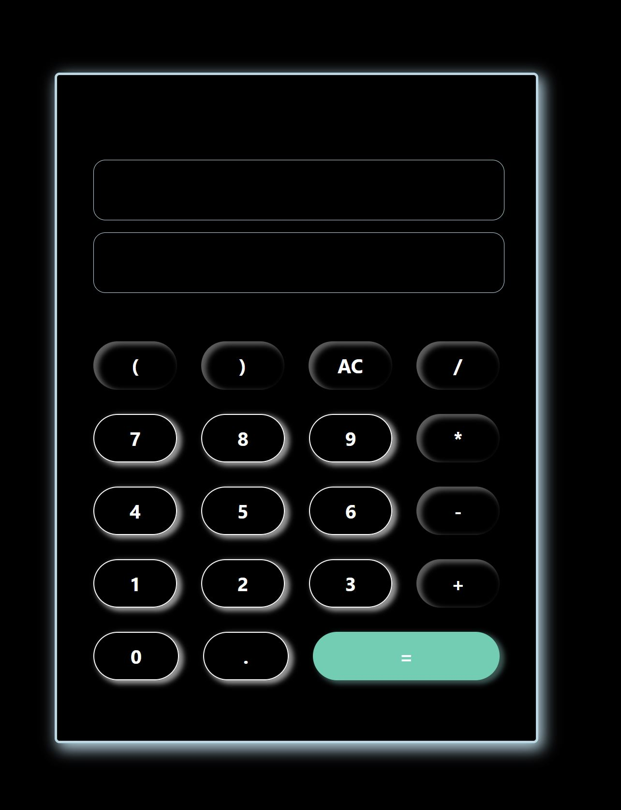

# Building a calculator

Here is the link to the [calculator](https://mariefourriere.github.io/calculator/)

## the challenge

At the end of this challenge you should be able to generate a simple app using the DOM utils and events.

Using what we know about javascript, we're going to build a simple calculator app.

- Type of challenge: **consolidation**  
- Duration: **2-3 days**  
- Team challenge: **solo**
- Deadline: **18/11/2020 19:00**
- [Submission form](https://forms.gle/UmTTfyF59kueUYhh7)

## The mission

- Create a new repository named `calculator`
- Create a `calculator.js` file.
- Create a file named `index.html`. In the `<body>` you can only put an empty `<main>` tag, and the link to your javascript file. The rest of the app has to be generated using your script
- You have to generate a calculator layout with a display on top and all the digits buttons (0 to 9), the operation buttons (`+`, `-`, `x`, `/`), a button to calculate the result (`=`) and a button to clear the display (`C`)
- Clicking on the button should emulate the behavior of a calculator.

### BONUS

- Create an history of the previous operations
- Scientific calculator (trigonometry, logarithms, ...). The [Math library](https://developer.mozilla.org/en-US/docs/Web/JavaScript/Reference/Global_Objects/Math) is pretty convenient for this.
- Unit conversion (could be money or imperial units to metric system for example)
- Pressing enter to display the result (same as pressing the `=` button)
- Make it pretty

## Preview

## Sources
Exercise part of my [BeCode](https://becode.org/) training 

